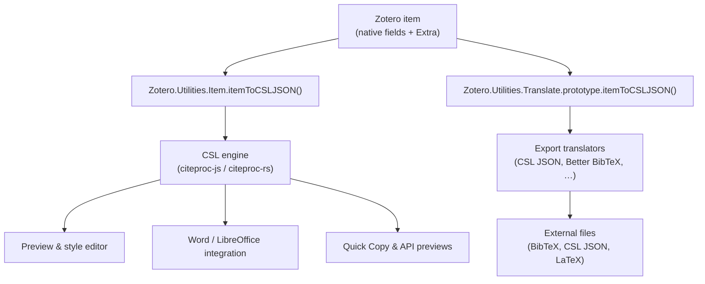
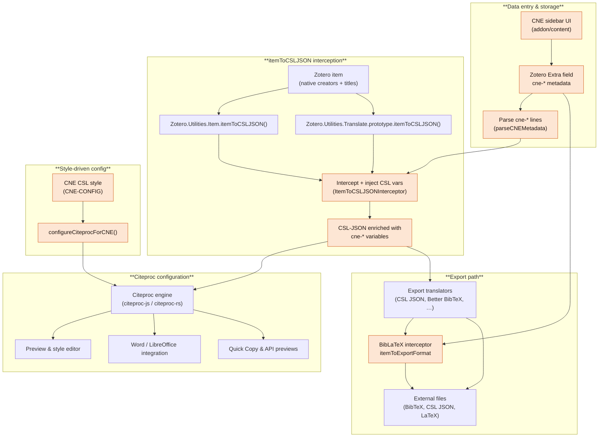

# Cite Non-English (CNE)

Cite Non-English (CNE) is a Zotero extension to support non-English citations — that just works.

---

## I. Core Concepts

### Demo Video

_A short walkthrough video will appear here once it is recorded._

### Overview

CNE keeps all representations of a non-English source—original script (汉字, 漢字, かな, 한글), romanization, translations, and locale-aware formatting—together inside Zotero while hiding the complexity of CSL styles, citation processors, and Zotero internals from users. It bundles the moving parts into a coherent extension with a stable API, so scholars can rely on a single tool that continues to work even as Zotero evolves.

Under the hood CNE does the hard work of coordinating styles, citeproc engines, and export flows so researchers can simply cite their sources, and the project is committed to maintaining that experience until native non-English citation support arrives in Zotero. The current focus is on CJK languages where style guides make parallel scripts mandatory, but the infrastructure is language-agnostic and designed to grow as the community contributes requirements and examples.

### Rationale

English-language citation guides (especially in the humanities and social sciences) often require both transliteration/romanization and the original script when citing non-English materials. For example, consider the same sources rendered by Zotero alone versus Zotero with the CNE version of Chicago 18th Notes & Bibliography:

#### Zotero native Chicago style

- 华林甫. “清代以来三峡地区水旱灾害的初步研究.” 中国社会科学 1 (1999): 168–79.
- 姜友邦. 圓融과調和: 韓國古代彫刻史의原理. Yŏrhwadang, 1990.
- 阿部善雄, and 金子英生. 最後の「日本人」: 朝河貫一の生涯. 岩波书店, 1983.

#### CNE version of Chicago 18th Notes & Bibliography

- Hua Linfu 华林甫. “Qingdai yilai Sanxia diqu shuihan zaihai de chubu yanjiu” 清代以来三峡地区水旱灾害的初步研究 [A preliminary study of floods and droughts in the Three Gorges region since the Qing dynasty]. _Zhongguo shehui kexue_ 中国社会科学 1 (1999): 168–79.
- Kang U-bang 姜友邦. _Wŏnyung kwa chohwa: Han’guk kodae chogaksa ŭi wŏlli_ 圓融과調和: 韓國古代彫刻史의原理 [Synthesis and harmony: Principle of the history of ancient Korean sculpture]. Yŏrhwadang, 1990.
- Abe Yoshio 阿部善雄, and Kaneko Hideo 金子英生. _Saigo no “Nihonjin”: Asakawa Kan’Ichi no shōgai_ 最後の「日本人」: 朝河貫一の生涯 [The last “Japanese”: Life of Kan’ichi Asakawa]. Iwanami Shoten, 1983.

For more examples, see the [bibliography snapshots for all curated styles](https://github.com/boan-anbo/cite-non-english/tree/main/snapshots).

Historically Zotero’s native Chicago style offered no built-in way to render both scripts, so scholars often turned to [Juris-M](https://juris-m.github.io/), a forked version of Zotero with multilingual infrastructure. That approach brought trade-offs:

- Maintaining Juris-M means keeping two independent Zotero databases in sync, because the two applications cannot share a single profile.
- Juris-M has effectively ceased active maintenance in recent years, leaving users without an up-to-date path for English-style citations of non-English sources.

CNE addresses these issues by bringing robust non-English citation support back to standard Zotero, eliminating the dual-install burden and providing a maintained path forward. At the same time, the project stands on the shoulders of Juris-M and its creator—the groundwork they laid makes CNE possible today. Readers looking for the technical details of how the plugin bridges these gaps can jump to the explanations in the Detailed Guides section below.

The current focus is on CJK sources because their style guides place the heaviest demands on parallel scripts. The infrastructure is intentionally language-agnostic, and I plan to expand coverage to additional languages as community contributors share requirements, examples, and tests.

### Features

- Dedicated fields in the sidebar for creators, titles, publisher, journal, series, and other metadata, with original-script and romanized variants stored together.
- Curated CSL styles (Chicago 18th, APA 7th, MLA 9th) tailored for multilingual output, keeping romanized, original, and translated forms aligned.
- Per-item overrides for punctuation, spacing, and name ordering so specialized style requirements are met without manual editing.
- All CNE metadata is stored inside the Zotero item (Extra + CNE panel), so your library stays portable and sync-friendly (no external files required).

---

## II. Quick Guide

### How to Use CNE

> _Placeholder screenshots — will be replaced with actual captures._

1. Download the latest release from the [CNE GitHub releases page](https://github.com/boan-anbo/cite-non-english/releases) and install the XPI in Zotero (Tools → Add-ons → Install Add-on From File…).

2. For each item, open the **CNE Citation Fields** panel in Zotero’s item sidebar and enter the original-script, romanized, and translated information you need.

3. In the CNE Citation Fields panel choose the item’s language (use “Original language” for CJK; leave “English” if you do not want CNE processing).

4. When citing, choose the curated CNE versions of the CSL styles (e.g., “Chicago 18th CNE”) so the parallel fields render automatically.

> **Note:** If you need a style that CNE hasn't curated yet, you can
>
> 1) open an issue requesting support, or
> 2) follow the instructions in the Detailed Guides below to adapt the infrastructure and create a CNE-compatible style yourself.

---

## III. Detailed Guides

### How Zotero Handles Citations

Zotero keeps every item’s native fields together with the literal text stored in the Extra field. Whenever that data needs to become CSL-JSON, core code invokes two different conversion functions:

- `Zotero.Utilities.Item.itemToCSLJSON()` – used by preview panes, quick copy, the note editor, and the Word/LibreOffice connectors. Once the JSON is assembled, `Zotero.Style.prototype.getCiteProc()` spins up a citeproc-js or citeproc-rs engine to render it.
- `Zotero.Utilities.Translate.prototype.itemToCSLJSON()` – assigned once at application start by copying the direct function onto each translator prototype. Export translators (CSL JSON, Better BibTeX, BibLaTeX, etc.) call this copy inside their sandboxes, so hot-patching the first function alone never reaches them.

The direct branch feeds everything rendered inside Zotero itself. The translator branch produces the data that every exporter consumes—built-in CSL JSON, Zotero’s own BibLaTeX/BibTeX translators, and third-party translators such as Better BibTeX all run inside the same sandbox. Their `ZU.itemToCSLJSON()` helper is defined once at startup by copying `Zotero.Utilities.Item.itemToCSLJSON` onto `Zotero.Utilities.Translate.prototype.itemToCSLJSON` (see `reference/zotero/chrome/content/zotero/xpcom/translate/src/utilities_translate.js:58`), and when they need the full item payload they call `Zotero.Utilities.Internal.itemToExportFormat` before serialising to BibTeX, BibLaTeX, LaTeX aux files, and so on (`reference/zotero/chrome/content/zotero/xpcom/translation/translate_item.js:1162-1188`). Because the prototype copy is made before any plugin code loads, CNE has to patch both entry points (and the citeproc engine constructor) to guarantee that every workflow sees the same enriched metadata.

**Node references in Zotero’s codebase:**

- `Zotero.Utilities.Item.itemToCSLJSON()` – `reference/zotero/chrome/content/zotero/xpcom/utilities/utilities_item.js:34-210`
- `Zotero.Utilities.Translate.prototype.itemToCSLJSON()` – `reference/zotero/chrome/content/zotero/xpcom/translate/src/utilities_translate.js:37-70`
- citeproc engine creation (`style.getCiteProc`) – `reference/zotero/chrome/content/zotero/xpcom/style.js:705-897`, invoked from Quick Copy (`reference/zotero/chrome/content/zotero/xpcom/quickCopy.js:281-396`), document integration (`reference/zotero/chrome/content/zotero/xpcom/integration.js:1890-3340`), and API/preview paths (`reference/zotero/chrome/content/zotero/xpcom/server/server_localAPI.js:960-1010`)
- Export translators & Better BibTeX pipeline – `reference/zotero/chrome/content/zotero/xpcom/translation/translate_item.js:1100-1400` plus the shared helpers in `reference/zotero/chrome/content/zotero/xpcom/utilities_internal.js:869-1110`

### Challenges for Citing Non-English Sources

The pain points come from two directions: Zotero’s runtime model and style-guide expectations.

#### From Zotero

- **Duplicated conversion functions** – The translator copy of `itemToCSLJSON` is frozen at start-up. Without patching both versions, enhanced data never reaches exporters (see `docs/ENGINE-INTEGRATION-POINTS.md`).
- **Engine caching** – citeproc engines persist between runs; name overrides must mark engines so rerenders do not double-apply (documented in `docs/cne-citeproc-override.md`).
- **Preference toggles** – Users need "Enable CNE Processing" to short-circuit wrappers when they work on English-only datasets (`docs/CNE-STYLE-CONVENTION.md`).
- **Extensibility surface** – Additional exporters (Better BibTeX, JSON, CSL) expect unmodified fields unless CNE provides a transformation layer (`docs/biblatex-integration.md`).
- **Opaque name processing** – The citeproc engine makes numerous formatting decisions internally without exposing configuration options to users. For example, it includes hardcoded handling for Japanese and Chinese names but omits Korean, leaving users unable to override or extend these behaviors.
- **Limited multilingual infrastructure** – CSL's name-handling system lacks robust support for per-author formatting rules, forcing plugins like CNE to inject pre-formatted literal names rather than leveraging CSL's native name-part system (see `docs/author-name-architecture.md`).

#### From style requirements

- **Parallel scripts, romanization, and English translation** – Humanities guides (Chicago, MLA, APA) demand romanized text, original script, and English translations all within the same citation.

  _Example:_ A Chinese journal article title must appear as:
  > "Qingdai yilai Sanxia diqu shuihan zaihai de chubu yanjiu" 清代以来三峡地区水旱灾害的初步研究 [A preliminary study of floods and droughts in the Three Gorges region since the Qing dynasty]

  showing romanization (Pinyin), original script (simplified Chinese), and English translation in brackets.

- **Evolving Asian name conventions** – Recent style guides increasingly require East Asian names to appear in their native order (family name first) without commas, reflecting a shift toward linguistically respectful formatting. Traditionally, names were formatted with Western-style comma separation:

  > Hua, Linfu (Chinese, Pinyin)
  > Ch'ien, Mu (Chinese, Wade-Giles)
  > Kang, U-bang (Korean)
  > Abe, Yoshio (Japanese)

  Modern guidelines (Chicago 18th edition, §11.89-11.99) now recommend the no-comma format followed by original script for scholars based in Asia:

  > Hua Linfu 华林甫
  > Ch'ien Mu 钱穆
  > Kang U-bang 姜友邦
  > Abe Yoshio 阿部善雄

  While well-intentioned, this convention adds further complexity for non-English citations: some styles (e.g., Chicago) even recommend per-author overrides where certain names still need commas despite the general no-comma rule. For instance, Korean persons living in the West (referred to in text as "Chang-rae Lee") may still require comma separation (Chicago 17th edition, §16.82):

  > Lee, Chang-rae

  Additionally, specialized formatting such as spacing within Japanese names (with space between family and given name in the original script) demands granular control that standard CSL cannot provide:

  > Abe Yoshio 阿部 善雄
- **Locale-sensitive typography** – Italics, quotation marks, and brackets change by language (Japanese APA vs. English APA; see `docs/apa-vs-apa-ja-comparison.md`).
- **Mixed workflows** – Scholars export to LaTeX, word processors, and snapshots simultaneously; the metadata must survive every path.

### CNE Solutions

CNE provides a stable, non-invasive solution that "just works" by separating concerns between data storage and output formatting.

#### CNE's Own Architecture

**Stable Data Model**

- All CNE metadata stored in Zotero's Extra field (no external files)
- Dedicated UI panel for entering original script, romanization, and translations
- **Key design principle**: Complete independence from Zotero's native fields
  - Users can freely choose to fill Title/Author fields with romanized, English, or original script
  - CNE output remains stable regardless of native field content
  - No conflicts between CNE and standard Zotero workflows

**Output via Custom CSL Styles**

- CNE relies on curated CSL styles (Chicago 18th CNE, APA 7th CNE, MLA 9th CNE)
- While citeproc has some multilingual support, it's inflexible and insufficient
- Custom CSL is the most elegant and explicit approach, and surprisingly simple
- Detailed CSL creation guides available upon request (open an issue)

**Name Processing with Interceptors**

- Combines citeproc capabilities with custom interceptors
- Injects pre-formatted literal names for per-author control
- See `docs/author-name-architecture.md` for technical details

#### CNE Integration with Zotero

CNE touches every stage of the pipeline so the metadata you enter in the sidebar survives previews, exports, and citeproc resets:

Nodes shaded in orange represent CNE-specific additions layered on top of Zotero’s native pipeline, while the unshaded nodes correspond directly to the core architecture shown in the previous diagram.

**How it works:**

- `ItemToCSLJSONInterceptor` (`src/modules/cne/interceptors/ItemToCSLJSONInterceptor.ts`) patches both conversion functions shown above, installs callback slots, and is toggled by `setCneProcessingEnabled`, which follows the `extensions.cne.enable` preference.
- `injectCSLVariables` (`src/modules/cne/callbacks/injectCSLVariables.ts`) reads the Extra field via `parseCNEMetadata` and writes canonical `cne-*` variables (`cne-title-romanized`, `cne-journal-original`, etc.) directly into the CSL-JSON object so curated CSL styles can read them even when Zotero’s parser skips those lines.
- `enrichAuthorNames` (`src/modules/cne/callbacks/enrichAuthorNames.ts`) matches indexed `cne-creator-N-*` lines back to the CSL creator arrays, fills the romanized `family`/`given` slots, and sets `multi.main` / `multi._key` so citeproc renders both scripts with predictable ordering.
- `GetCiteProcInterceptor` (`src/modules/cne/interceptors/GetCiteProcInterceptor.ts`) wraps `Zotero.Style.prototype.getCiteProc()`, extracts the style’s `CNE-CONFIG` block, and runs `configureCiteprocForCNE` so citeproc-js and citeproc-rs keep the requested `cite-lang-prefs` (e.g., `['translit', 'orig']`) even after the engine resets.
- `initializeBibLaTeXIntegration` (`src/modules/cne/biblatex-export.ts`) intercepts `Zotero.Utilities.Internal.itemToExportFormat`, injects `biblatex.*` lines into the export copy’s Extra field, and lets Better BibTeX consume them without altering the stored item.

**Node references in the CNE source tree:**

- Sidebar UI & Extra storage – `addon/content/pane/*` provides the UI that records `cne-*` metadata; saved values surface via the item’s `extra` field.
- Metadata parser – `parseCNEMetadata()` and helpers in `src/modules/cne/metadata-parser.ts:1-230`.
- Interceptor stack – `src/modules/cne/interceptors/ItemToCSLJSONInterceptor.ts:59-210` plus callbacks `src/modules/cne/callbacks/injectCSLVariables.ts` and `src/modules/cne/callbacks/enrichAuthorNames.ts`.
- Citeproc configuration – `src/modules/cne/interceptors/GetCiteProcInterceptor.ts` + `src/modules/cne/config/parseCNEConfig.ts` + `src/modules/cne/config/configureCiteproc.ts`.
- Export integration – `src/modules/cne/biblatex-export.ts` with mappings in `src/modules/cne/biblatex-mapper.ts`.
- `watchCneProcessingPreference()` (in `src/modules/cne/index.ts`, called from `src/hooks.ts`) keeps the runtime install/uninstall cycle in sync with the preference so toggling “Enable CNE Processing” in the UI immediately removes or reinstalls every interceptor.

### Known Issues

- Only curated CSL styles receive enhanced behaviour; others fall back to Zotero's native formatting.
- Items must have the correct language selected in the CNE sidebar—choosing "English" intentionally bypasses CNE processing.
- Export formats beyond CSL/BibLaTeX currently receive unmodified data.
- Translators that cache citeproc engines may require a Zotero restart after toggling "Enable CNE Processing."

---

## IV. Development

### Building on CNE

#### Project Layout & Key Modules

- `src/modules/cne/` – interceptors, callbacks, BibLaTeX integration, preference helpers.
- `addon/content/` – sidebar UI, localisation, preference panel.
- `test/csl-tests/` – Mocha specs, fixtures, snapshots.

#### Extending CSL Styles

1. Copy an existing style from `styles/cne/`.
2. Wire new CSL macros or variables to the `cne-*` fields produced by the interceptors (see `docs/citation-styles/`).
3. Add expectations under `test/csl-tests/expectations/` and regenerate snapshots with `npm test`.

### Testing

The output of all curated styles is consolidated with thorough testing. Run `npm test` to execute Mocha specs and update snapshots under `snapshots/`.

### Contributing

High-impact areas include new CSL styles, language-specific formatting rules, regression tests, documentation, and localisation. Fork the repository, create a feature branch, run the tests, and open a pull request. When requesting a new style, open an issue with examples and references to the relevant style manual.

---

## V. FAQ

**Q: What if I need a style that CNE hasn't curated yet?**

A: Open an issue with your request, or follow the Detailed Guides (III.3) to adapt the infrastructure and create a CNE-compatible style yourself.

**Q: What if I need integration with other Zotero plugins?**

A: Please open an issue describing your integration needs. I'm happy to work with other plugin developers to ensure compatibility.

---

## VI. Resources

- [UBC Library: CNE (Cite Non-English) Citation Guide](https://guides.library.ubc.ca/c.php?g=707463&p=5291936)
- [Yale CJK Citation Styles](https://guides.library.yale.edu/c.php?g=296262)
- [Handling Non-English Metadata in Zotero](https://jdavidstark.com/how-to-easily-handle-non-english-citation-information-in-zotero/)
- [Customizing Chicago 17 for Japanese/Chinese](https://gist.github.com/tom-newhall/88557892c6646b8cfda9e8963c2b733d)
- [CSL Forum: Rendering Japanese Author Names](https://discourse.citationstyles.org/t/is-it-possible-to-render-name-part-affixes-in-japanese-author-names/1828/18)
- [Zotero 7 Developer Documentation](https://www.zotero.org/support/dev/zotero_7_for_developers)
- [Zotero Plugin Toolkit](https://github.com/windingwind/zotero-plugin-toolkit)
- [Zotero Types](https://github.com/windingwind/zotero-types)
- [Better BibTeX Documentation](https://retorque.re/zotero-better-bibtex/)

---

## VII. License

AGPL-3.0-or-later. Built using the [Zotero Plugin Template](https://github.com/windingwind/zotero-plugin-template) by windingwind.

---

## Support & Acknowledgments

- File issues or start discussions on GitHub (`Issues` / `Discussions` tabs).
- Thanks to the Zotero community, the CNE research group, and contributors expanding multilingual citation support.
