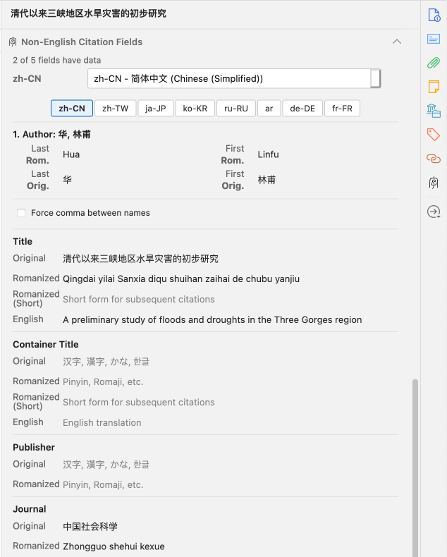
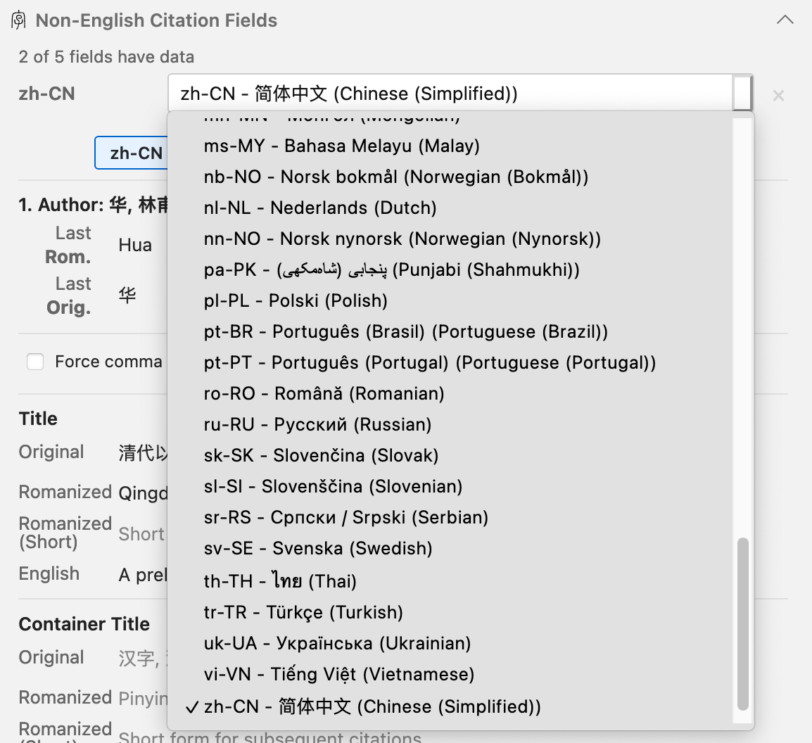
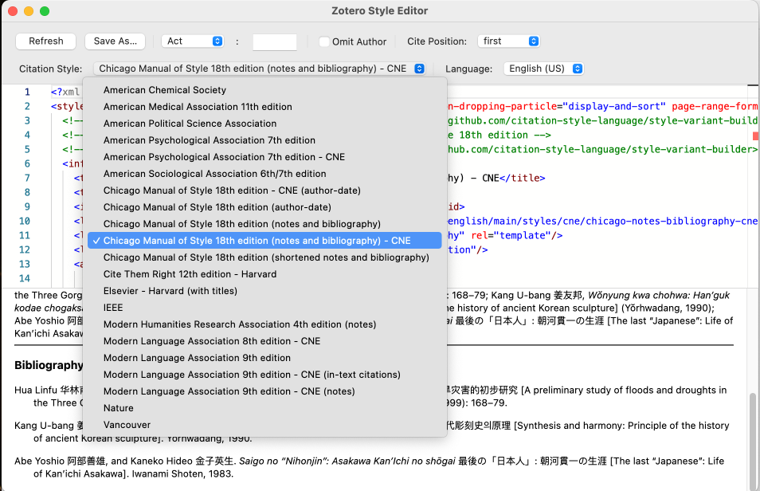
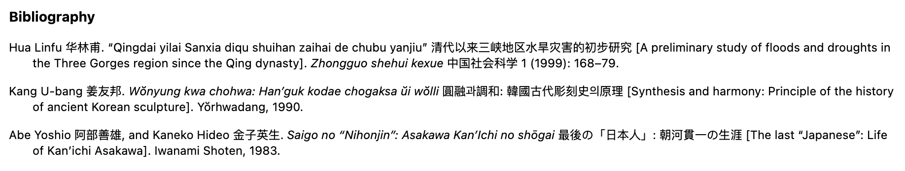
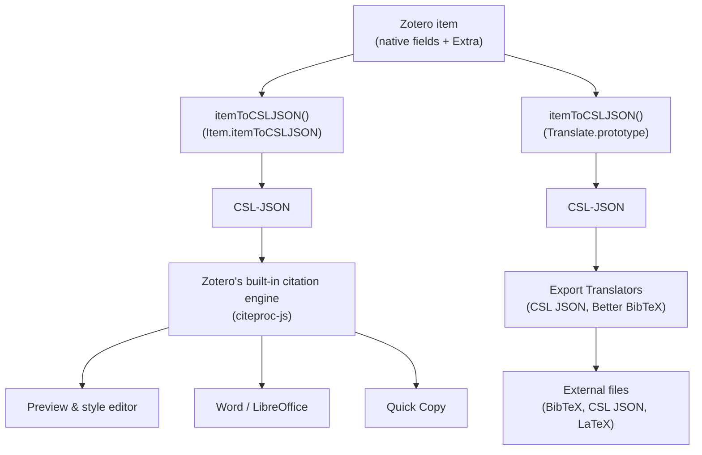
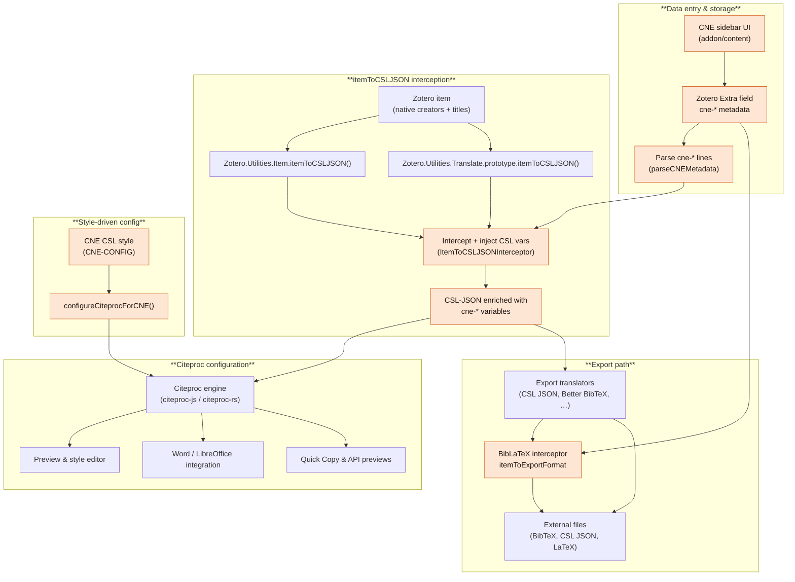

# Cite Non-English (CNE)

[](https://www.zotero.org)
[](https://github.com/windingwind/zotero-plugin-template)

Cite Non-English (CNE) is a Zotero extension to provide all-in-one support for non-English citations that just works.

Using an agent? Start with the [Agent quick start](#agent-quick-start).

---

## I. Overview

### CNE Demo

<https://github.com/user-attachments/assets/50c3e7eb-a79a-41bb-8eb6-774a9f80b3a6>

_Download the demo video_: [CNE Demo](https://github.com/user-attachments/assets/50c3e7eb-a79a-41bb-8eb6-774a9f80b3a6)

### Overview

CNE enables you to manage metadata for non-English sources and output correctly formatted citations—all inside Zotero. It bridges the moving parts into a coherent extension with a stable API, so you can rely on a single tool that continues to work even as Zotero evolves.

Under the hood CNE does the hard work of coordinating Zotero internals, citation styles, citeproc engines, and export workflows so you can simply cite your sources without worrying about the technical details. The project is committed to maintaining that experience until native non-English citation support is built into Zotero.

### Rationale

English-language citation guides (especially in the humanities and social sciences) often require both transliteration/romanization and the original script when citing non-English materials. For example, consider the same sources rendered by Zotero alone versus Zotero with the CNE version of Chicago 18th Notes & Bibliography:

#### Zotero native Chicago style

- 华林甫. “清代以来三峡地区水旱灾害的初步研究.” 中国社会科学 1 (1999): 168–79.
- 姜友邦. 圓融과調和: 韓國古代彫刻史의原理. Yŏrhwadang, 1990.
- 阿部善雄, and 金子英生. 最後の「日本人」: 朝河貫一の生涯. 岩波书店, 1983.

#### CNE version of Chicago 18th Notes & Bibliography

- Hua Linfu 华林甫. “Qingdai yilai Sanxia diqu shuihan zaihai de chubu yanjiu” 清代以来三峡地区水旱灾害的初步研究 [A preliminary study of floods and droughts in the Three Gorges region since the Qing dynasty]. _Zhongguo shehui kexue_ 中国社会科学 1 (1999): 168–79.
- Kang U-bang 姜友邦. _Wŏnyung kwa chohwa: Han’guk kodae chogaksa ŭi wŏlli_ 圓融과調和: 韓國古代彫刻史의原理 [Synthesis and harmony: Principle of the history of ancient Korean sculpture]. Yŏrhwadang, 1990.
- Abe Yoshio 阿部善雄, and Kaneko Hideo 金子英生. _Saigo no “Nihonjin”: Asakawa Kan’Ichi no shōgai_ 最後の「日本人」: 朝河貫一の生涯 [The last “Japanese”: Life of Kan’ichi Asakawa]. Iwanami Shoten, 1983.

For more examples, see the [bibliography snapshots for all curated styles](https://github.com/boan-anbo/cite-non-english/tree/main/snapshots).

Historically **Zotero’s native item data structure and official CSLs offered no built-in way to render formats like this for non-English sources**, so scholars often turned to [Juris-M](https://juris-m.github.io/), a forked version of Zotero with multilingual infrastructure. That approach has trade-offs:

- Maintaining Juris-M means keeping two independent Zotero/Juris-M databases.
- Juris-M has effectively ceased active maintenance in the last two years, leaving users without an up-to-date path for English-style citations of non-English sources. (Correction: Juris-M is currently being updated by Frank Bennett to support Zotero 7.0 and beyond as of October 2025. Please visit its [Discord server](https://discord.gg/4a2N2XDC) for updates.)

CNE addresses these issues by **bringing robust non-English citation support back to standard Zotero**, eliminating the dual-install burden and providing a maintained path forward. At the same time, **the project stands on the shoulders of Juris-M and its creator**—the groundwork they laid makes CNE possible today. Readers looking for the technical details of how the plugin bridges these gaps can jump to the explanations in the [Detailed Guides](#iii-detailed-guides) section below.

### CNE Features

- Manage multilingual fields in the Cite Non-English (CNE) panel for creators, titles, publisher, journal, series, and other metadata, with original-script and romanized variants stored together.
- Curated CSL styles (Chicago 18th notes, Chicago 18th shortened notes, APA 7th, MLA 8th & 9th and more to come) tailored based on official style handbooks. In Zotero, these styles will be installed automatically when you install CNE and has `CNE` added to the style name.
- Per-item overrides for punctuation, spacing, and name ordering so specialized style requirements are met without manual editing.
- All CNE metadata is stored inside the Zotero item (Extra + CNE panel), so your library stays portable and sync-friendly (no external files required).
- Internal APIs are patched so that any Zotero features and integrations _should_ just work to support CNE. Any compatibility issues should be reported as bugs in the [issue tracker](https://github.com/boan-anbo/cite-non-english/issues).

The **current development focus** is on CJK sources. The infrastructure is intentionally language-agnostic, and the project plans to expand coverage to additional languages as community contributors share requirements, examples, and tests. **If you are interested in contributing to CNE, please [open an issue](https://github.com/boan-anbo/cite-non-english/issues/new) or submit a Pull Request**.

### Roadmap

- [ ] Consolidate the support for Better BibTeX's export to BibLaTeX and, possibly, BibTeX with extensive testing to make CNE work seamlessly with LaTeX.
- [x] Let agents read, validate, preview, and save romanization and translation through a local JSON interface. See [Agent quick start](#agent-quick-start).

---

## II. Quick Guide

### Agent quick start

An agent with local HTTP access can work directly with CNE in Zotero. For example:

- “Add title and creator-name pinyin to my selected Chinese references. Keep existing values.”
- “Add English title translations and show each reference in Chicago, APA, and MLA before saving.”
- “Find references missing title romanization in this library and fill them in batches.”
- “Correct these translations and clear the short titles I no longer need.”

**Connect once:** install a CNE build with Agent access, keep Zotero running, and
enable **Settings → CNE → Agent access**. Choose **Copy connection** and give it to
your local agent. The connection contains `baseURL` and authentication `headers`;
keep its token private. No MCP setup is required.

**For the agent:**

1. Send `GET` to the copied `baseURL`, with the copied `headers`. The response's
   `result` describes every operation, its HTTP path, input schema, and field names.
   Use that live catalog to construct requests; operation calls use JSON `POST`.
2. Start with `POST {baseURL}/selection/read` and body `{}`. Or use
   `libraries.list` and page through `items.search`, checking each item's `values`
   for missing fields. Reads return `item`, `revision`, `native` context, and CNE
   `values`. Generate the romanization or translation yourself.
3. Build edits using the read's `item`, its `revision` as `expectedRevision`, and
   `changes` such as `{"path":"title.romanized","value":"Zhongguo lishi yanjiu"}`.
   Use `mode: "fillMissing"` to retain existing values, or `null` to clear a field.
   Creator paths such as `creators.0.lastRomanized` follow `native.creators` order.
4. Use `items.validate` to check edits and `styles.list` → `items.preview` to show
   actual citation output without saving. When the user's request authorizes
   saving, call `items.patch` with `{"edits": [...]}` (up to 50 items). Its `current`
   records are saved readback. On a 409 conflict, read again and review the changes.

CNE supplies the library access, validation, rendering, and persistence; your
agent supplies the language judgment. Install the [`skills/cne`](skills/cne) folder
with your agent's skill loader, or read the [CNE skill](skills/cne/SKILL.md) for
operating guidance and connection troubleshooting. Live discovery provides the
API schemas. The [integration tests](test/agent)
exercise real Zotero HTTP, storage, sidebar updates, and citation output with
supplied text; they do not evaluate a language model's translation quality.

### How to Use CNE

1. **Download** the latest CNE XPI from the [releases page](https://github.com/boan-anbo/cite-non-english/releases) and **install** it in Zotero (Tools → Plugins).

2. For each item, open the **Cite Non-English (CNE)** panel in Zotero's item sidebar and enter the original-script, romanized, and translated information you need.
   

3. In the Cite Non-English (CNE) panel choose the item's language, or click the quick language buttons, e.g., "zh-CN", "zh-TW", "ja-JP", "ko-KR".
   

4. When citing, choose the curated CNE versions of the CSL styles (e.g., "Chicago 18th CNE") so the multilingual fields render correctly.
   

5. The citations will render with appropriate romanization, original script, and English translation for names and titles:
   

---

## III. Detailed Guides

### How Zotero Handles Citations

When you store a book, article, or other source in Zotero, all its information—title, author, publisher, and so on—lives in your library as a Zotero item. For fields not natively supported by Zotero, you can add custom information in the Extra field in the format of `key: value` lines--this is how CNE stores its metadata such as `cne-title-original: 清代以来三峡地区水旱灾害的初步研究`.

When you use the citation of the given item(s) (in Word, in a Style Editor preview, or by exporting it to citation data files), Zotero must first convert your item data to CSL-JSON format—a standardized format that citation processors understand. However, due to Zotero's architecture, this conversion happens through **two separate function references**:

**Path 1: Live Citations** (for Style Editor previews, Word/LibreOffice integration, Quick Copy, etc.)

- Uses `Zotero.Utilities.Item.itemToCSLJSON()` to convert → CSL-JSON → Zotero's built-in citation engine (`citeproc-js`) → formatted citation

**Path 2: File Exports** (for BibTeX, Better BibTeX, CSL JSON, etc.)

- Uses `Zotero.Utilities.Translate.prototype.itemToCSLJSON()` to convert → CSL-JSON → export translators → external files (e.g. `.bib` for BibTeX and BibLaTex)


```mermaid
flowchart TB
  Item["Zotero item<br/>(native fields + Extra)"]
  ItemToCSL1["itemToCSLJSON()<br/>(Item.itemToCSLJSON)"]
  ItemToCSL2["itemToCSLJSON()<br/>(Translate.prototype)"]
  CSL1["CSL-JSON"]
  CSL2["CSL-JSON"]
  Engine["Zotero's built-in citation engine<br/>(citeproc-js)"]
  Preview["Preview & style editor"]
  WP["Word / LibreOffice"]
  QuickCopy["Quick Copy"]
  Exporters["Export Translators<br/>(CSL JSON, Better BibTeX)"]
  Files["External files<br/>(BibTeX, CSL JSON, LaTeX)"]

  Item --> ItemToCSL1
  Item --> ItemToCSL2
  ItemToCSL1 --> CSL1
  ItemToCSL2 --> CSL2
  CSL1 --> Engine
  Engine --> Preview
  Engine --> WP
  Engine --> QuickCopy
  CSL2 --> Exporters
  Exporters --> Files

```

> **For developers:** The technical implementation involves patching `Zotero.Utilities.Item.itemToCSLJSON()` (live citations) and `Zotero.Utilities.Translate.prototype.itemToCSLJSON()` (exports), plus configuring the citeproc engine. See [`docs/developer_guide.md`](docs/developer_guide.md#technical-implementation-details) for details.

### Challenges for Citing Non-English Sources

The challenges for supporting non-English citations come from two directions: Zotero and its integrations, and style-guide expectations.

#### From Zotero and its integrations

- **No native field support** – Zotero provides no built-in fields for romanized titles, translated titles, original-script variants, or alternative publisher names. Parallel metadata must be stored in the Extra field and parsed by plugins.

- **Citeproc's limitations and hardcoded internal logic** – The [citeproc engines (`citeproc-js`)](https://github.com/Juris-M/citeproc-js) have limitations and hardcode language-specific handling.
  For example, `citeproc-js` has hardcoded special handling for "Asian names" but only included Chinese and Japanese, not Korean. As another example, `citeproc-js` makes formatting decisions on behalf of users without exposing configuration options. For example, romanized Asian names can _only_ (hardcoded logic) render with a single space and no comma between family and given names (e.g., "Hao Chunwen"), making comma-separated formats required by certain styles (see the challenges from the style guides below) unavailable. These decisions are hardcoded into the engine's internal logic and cannot be overridden through CSL. Lack of documentation of the citeproc also makes it difficult to extend and/or circumvent its limitations. But again, despite these flaws, `citeproc-js` provided the critical infrastructure to support multilingual citations in Zotero upon which CNE is built.

- **Undocumented internal APIs** – Citeproc's internal APIs governing name processing and cite-lang-prefs configuration are neither documented nor designed for external use. Implementing CNE requires reverse-engineering these internals and maintaining patches across Zotero updates.

- **CSL's limited extensibility** – [CSL (Citation Style Language)](https://citationstyles.org/), another admirable work in itself, offers basic locale support but lacks extensibility for multilingual citations. Name handling lacks configurability and left to the discretion of citeproc, and there is no official mechanism or conventions for supporting non-English citations. CSL-M, an extended multilingual format developed as part of the Juris-M project and to be used with `citeproc-js`, is not officially recognized by the latest CSL specifications and faces an uncertain future in Zotero's ecosystem.

- **Zotero Built-in styles do not support features for handling non-English sources** – Zotero's curated CSL styles (Chicago, APA, MLA, etc.) provide no support for features such as romanization, original-script, and English translation.

#### From style requirements

- **Parallel scripts, romanization, and English translation** – Style guides select different combinations of these variants. CNE's Chicago styles can show all three in full references; its APA style uses romanization and English translation.

  _Example:_ A Chinese journal article title must appear per some guides as:

  > "Qingdai yilai Sanxia diqu shuihan zaihai de chubu yanjiu" 清代以来三峡地区水旱灾害的初步研究 [A preliminary study of floods and droughts in the Three Gorges region since the Qing dynasty]

- **Evolving Asian name conventions** – Recent style guides increasingly require East Asian names to appear in their native order (family name first) without commas, reflecting a shift toward linguistically respectful formatting. Traditionally, names were formatted with Western-style comma separation:

  > Hua, Linfu (Chinese, Pinyin)

  > Ch'ien, Mu (Chinese, Wade-Giles)

  > Kang, U-bang (Korean)

  > Abe, Yoshio (Japanese)

  Modern guidelines (Chicago 18th edition, §11.89-11.99) now recommend the no-comma format followed by original script for scholars based in Asia:

  > Hua Linfu 华林甫

  > Ch'ien Mu 钱穆

  > Kang U-bang 姜友邦

  > Abe Yoshio 阿部善雄

  While well-intentioned, this convention adds further complexity for non-English citations. Additionally, some styles (e.g., Chicago) even recommend "exceptions to exceptions" such as per-author overrides where certain names still need commas despite the general no-comma rule for CJK names. For instance, Korean persons living in the West (referred to in text as "Chang-rae Lee") may still require comma separation (Chicago 17th edition, §16.82):

  > Lee, Chang-rae

  Additionally, specialized formatting such as spacing within Japanese names (with space between family and given name in the original script) demands granular control that standard CSL cannot provide:

  > Takumi Ikeda 池田 巧

- **Special title casing for romanized titles** – Romanized titles often need to be capitalized differently from the English convention. For example:

  > Incorrect: "Qingdai Yilai Sanxia Diqu Shuihan Zaihai De Chubu Yanjiu"

  > Correct: Qingdai yilai Sanxia diqu shuihan zaihai de chubu yanjiu

  Note that "Sanxia" is capitalized because it is a proper noun.

### CNE Solutions

CNE separates concerns between data storage and output formatting to provide stable multilingual citation support without modifying Zotero's core data structures.

#### CNE's Own Architecture

**Stable Data Model**

- All CNE metadata stored in Zotero's Extra field
- Dedicated UI panel for entering original script, romanization, and translations
- **Key design principle for CNE item data**: Complete independence from Zotero's native fields
  - Users can freely choose to fill the native Title/Author fields with romanized, English, or original script, whichever makes sense for the user.
  - For fields explicitly supplied in CNE, the selected style determines which variants to display
  - No conflicts between CNE and standard Zotero workflows

**Output via Custom CSL Styles**

- CNE provides curated CSL styles (Chicago 18th CNE, Chicago 18th shortened notes CNE, APA 7th CNE, MLA 9th CNE) to make special handling for non-English sources with CNE item data possible. These styles are installed automatically when you install CNE and has `CNE` added to the style name.
- See [`styles/cne/`](styles/cne/) for the curated CSL styles.

**Name Processing with Interceptors**

- Combines citeproc capabilities with custom interceptors
- Injects pre-formatted literal names for per-author control
- Uses `multi.main` and `multi._key` structures for dual-script rendering

#### CNE Integration with Zotero

CNE touches every stage of the pipeline so the metadata you enter in the Cite Non-English (CNE) panel survives previews, exports, and citeproc resets while maintaining backwards compatibility with standard Zotero workflows:


```mermaid
flowchart TB
  subgraph DataEntry["**Data entry & storage**"]
    Panel["CNE sidebar UI<br/>(addon/content)"] --> Extra["Zotero Extra field<br/>cne-* metadata"]
    Extra --> Parser["Parse cne-* lines<br/>(parseCNEMetadata)"]
  end

  subgraph Conversion["**itemToCSLJSON interception**"]
    Item["Zotero item<br/>(native creators + titles)"] --> ItemFn["Zotero.Utilities.Item.itemToCSLJSON()"]
    Item --> TranslateFn["Zotero.Utilities.Translate.prototype.itemToCSLJSON()"]
    Parser --> Callbacks["Intercept + inject CSL vars<br/>(ItemToCSLJSONInterceptor)"]
    ItemFn --> Callbacks
    TranslateFn --> Callbacks
    Callbacks --> CSL["CSL-JSON enriched with<br/>cne-* variables"]
  end

  subgraph Citeproc["**Citeproc configuration**"]
    CSL --> CiteprocEngine["Citeproc engine<br/>(citeproc-js / citeproc-rs)"]
    CiteprocEngine --> Preview["Preview & style editor"]
    CiteprocEngine --> WP["Word / LibreOffice integration"]
    CiteprocEngine --> QuickCopy["Quick Copy & API previews"]
  end

  subgraph StyleConfig["**Style-driven config**"]
    Style["CNE CSL style<br/>(CNE-CONFIG)"] --> Configure["configureCiteprocForCNE()"]
  end
  Configure --> CiteprocEngine

  subgraph Exports["**Export path**"]
    CSL --> Translators["Export translators<br/>(CSL JSON, Better BibTeX, …)"]
    Translators --> Bib["BibLaTeX interceptor<br/>itemToExportFormat"]
    Translators --> Files["External files<br/>(BibTeX, CSL JSON, LaTeX)"]
  end

  Extra --> Bib
  Bib --> Files

  classDef cne fill:#fde6d4,stroke:#d25c1b,color:#1f140f;
  class Panel,Extra,Parser,Callbacks,CSL,Style,Configure,Bib cne;
```

_Nodes shaded in orange represent CNE-specific additions layered on top of Zotero's native pipeline, while the unshaded nodes correspond directly to the core architecture shown in the previous diagram._

**How CNE works:**

The diagram above shows CNE's intervention points (orange nodes) in Zotero's citation pipeline. Here's what happens at each stage:

1. **Entering and storing CNE metadata** (Panel → Extra)

   When you fill in the Cite Non-English (CNE) panel—entering romanized titles like "Tang houqi wudai Songchu", original scripts like 唐后期五代宋初, English translations like "[The social existence of monks...]", and the same for authors, journals, and publishers—CNE immediately saves this information into Zotero's Extra field as specially-formatted `cne-*` lines. This structured storage ensures your metadata persists with the item and survives sync, backup, and migration.

2. **Parsing CNE metadata from the Extra field** (Parser)

   Before Zotero converts an item to citation format, CNE's parser reads the Extra field and extracts all `cne-*` lines into a structured internal representation. For each field (title, container-title, publisher), the parser separates romanized, original, and English variants. For authors, it indexes each creator with their position (e.g., `cne-creator-0-last-romanized`, `cne-creator-0-last-original`) so they can be matched to Zotero's creator array later.

3. **Enriching CSL-JSON with CNE variables** (Callbacks → CSL)

   CNE intercepts both of Zotero's conversion paths—the live citation path (`itemToCSLJSON()`) and the export path (`Translate.prototype.itemToCSLJSON()`)—and injects the parsed CNE metadata directly into the CSL-JSON object that citeproc consumes. Simple fields become new CSL variables (e.g., `cne-title-romanized`, `cne-container-title-original`). Authors require deeper enrichment: CNE matches indexed creator data to each name in the CSL creator array, filling in romanized `family`/`given` slots and setting `multi.main` and `multi._key` objects so citeproc can render both romanization and original script in the order you've configured.

4. **Configuring citeproc for multi-slot rendering** (Style + Configure)

   When Zotero initializes a citeproc engine, CNE reads the `CNE-CONFIG` metadata embedded in the CSL style file to determine display preferences—for example, whether to show both romanized and original author names (`["translit", "orig"]`) or just romanized (`["translit"]`), and how to format romanized CJK names (with or without commas, with or without spacing in the original script). Styles may also set a citation-only override, such as rendering notes with romanized names while keeping bibliography entries romanized + original script. CNE then applies these preferences to the engine's `cite-lang-prefs` setting and installs a persistent override hook that reapplies the configuration whenever citeproc internally resets it during processing. This ensures the Style Editor, bibliography previews, and Word integration all consistently render the parallel scripts you expect.

5. **Preparing BibLaTeX exports** (Bib)

   When you export items to BibTeX or Better BibTeX, CNE intercepts the export conversion process and transforms CNE metadata into BibLaTeX-compatible fields. Romanized titles become `title`, original scripts become `userf`, English translations become `usere`, and similar mappings apply to journals, publishers, and authors. CNE writes these transformed fields into a temporary copy of the item's Extra field that only the export translator sees, ensuring your stored data remains unchanged while Better BibTeX receives properly-formatted metadata it can parse and render in your LaTeX documents.

**The result:** Your parallel metadata is available when previewing citations, citing in a word processor, or exporting. The selected style determines which variants appear and how they are formatted.

> **For developers:** Detailed technical implementation information, including interceptor architecture, callback chains, and source code locations, is available in [`docs/developer_guide.md`](docs/developer_guide.md#technical-implementation-details).

### Extra-field reference

The sidebar stores nonempty values as `key: value` lines in Extra. You can also enter these lines directly. The table lists the text fields exposed by the sidebar; a stored variant is displayed only when the selected style calls for it.

| Field           | Extra keys                                                                                                                            |
| --------------- | ------------------------------------------------------------------------------------------------------------------------------------- |
| Title           | `cne-title-original`, `cne-title-romanized`, `cne-title-romanized-short`, `cne-title-english`                                         |
| Container title | `cne-container-title-original`, `cne-container-title-romanized`, `cne-container-title-romanized-short`, `cne-container-title-english` |
| Publisher       | `cne-publisher-original`, `cne-publisher-romanized`                                                                                   |
| Journal         | `cne-journal-original`, `cne-journal-romanized`                                                                                       |
| Series          | `cne-series-original`, `cne-series-romanized`                                                                                         |

Creator keys use **`cne-creator-`**, including authors, editors, and other creator roles. Replace `0` with the creator's zero-based position in the item's creator list (`0` for the first creator, `1` for the second, and so on):

```text
cne-creator-0-last-original: 郝
cne-creator-0-first-original: 春文
cne-creator-0-last-romanized: Hao
cne-creator-0-first-romanized: Chunwen
```

For an organization or another single-field creator, put the complete name in the `last` field and leave `first` empty. Optional per-creator formatting keys are:

```text
cne-creator-0-options-original-spacing: true
cne-creator-0-options-force-comma: true
```

These options control spacing in the original-script name and comma separation in the romanized name. They accept `true` or `false` and are subject to the selected style's rendering rules.

Set the source language using the sidebar selector or Zotero's native Language field, preferably with a code such as `zh-CN`, `ja`, `ko`, `he`, or `en-US`. The parser also recognizes `cne-original-language: he` as an override used by creator enrichment; the sidebar language selector writes the native Language field.

Use the canonical `romanized-short` spelling for short titles. Existing `romanizedShort` keys remain readable for compatibility; saving writes the canonical form.

### Title selection and APA non-English sources

CNE separates **the original language**, **its romanization**, and **an English translation**. Romanization changes the script, not the language. Enter romanized titles with the desired capitalization, including proper nouns: CNE preserves that casing. Native English titles can stay in sentence case; Chicago applies its own title-casing rules when using the native title.

The curated styles deliberately differ:

- **Chicago:** romanized title, original-script title, and bracketed English translation in full references. Shortened notes omit the original and translation.
- **APA:** romanized title followed by the bracketed English translation. It does not append the original-script title to that combination. This is also the convention in the [University of Queensland's non-Latin-script example](https://guides.library.uq.edu.au/referencing/apa7/non-english-scripts).

For example, these illustrative Hebrew fields:

```text
cne-title-original: ספר לדוגמה
cne-title-romanized: Sefer ledugma
cne-title-english: An example book
```

produce the APA book-title portion _Sefer ledugma_ [An example book]. Set the item's Language to `he` and choose the CNE APA style. CNE does not automatically transliterate or translate the text.

**Filling only Original does not activate APA’s CNE title rendering.** That path requires `cne-title-romanized`; the optional `cne-title-english` supplies the bracketed translation. Selecting Hebrew as the language does not generate these values. The original script remains stored for styles that display it. This is the existing APA selection rule, not an automatic substitution between missing variants.

The [UQ page for non-English languages](https://guides.library.uq.edu.au/referencing/apa7/non-English) uses French and German examples, already written in Latin letters. Its separate non-Latin-script page explains the transliteration step. “Original-language title” does not necessarily mean “original-script title.”

### Known Issues

- Only curated CSL styles receive enhanced behaviour; others fall back to Zotero's native formatting.
- **Items must have the correct language selected in the Cite Non-English (CNE) panel**—choosing `en` or leaving the field empty intentionally bypasses _some_ of CNE processing. So when you notice weird output, such as romanized names with comma when it shouldn't, make sure if you have selected the correct language.
- Integration with Better BibTeX is not yet fully implemented and tested. It's the next item on the roadmap.

---

## IV. Development

### Building on CNE

#### Project Layout & Key Modules

- `src/modules/cne/` – interceptors, callbacks, integration, preference helpers.
- `addon/content/` – sidebar UI, localisation, preference panel.
- `test/csl-tests/` – Mocha specs, fixtures, snapshots.

For more details, see [`docs/developer_guide.md`](docs/developer_guide.md).

### Testing

The output of all curated styles is consolidated with thorough testing. Run `npm test` to execute Mocha specs and update snapshots under `snapshots/` with `npm run test:snapshots:update`.

---

## V. FAQ

**Q: What if I need a style that CNE hasn't curated yet?**

A: Open an issue with your request, or follow the Detailed Guides (III.3) to adapt the infrastructure and create a CNE-compatible style yourself.

**Q: Does CNE affect Zotero sync?**

A: No. CNE stores all metadata in Zotero's Extra field, which syncs normally across devices. Your CNE data travels with your library.

**Q: I'm formatting citation using a Japanese APA style, but the output of CNE APA 7th style does not look right.**

A: It's because CNE APA 7th style is the _English_ APA style with support for citing non-English sources. Picking Japanese locale for the English APA style does not really give you the correct output either. What you need is a dedicated _Japanese_ APA style with CSL plus CNE support for providing CNE item data. If you don't know how to create a CSL style, raise an issue and if enough people are interested, I'll consider adding it to the curated styles.

**Q: What happens if I disable or uninstall the plugin?**

A: Your data remains safe in the Extra field. CNE metadata lines (starting with `cne-`) stay in your items but won't be processed without the plugin active. Re-enabling CNE restores full functionality.

**Q: Does CNE modify my stored items permanently?**

A: CNE stores parallel text and creator variants in Extra without changing your native Title or creator names. The language selector updates Zotero’s native Language field. The selected style controls which CNE variants are displayed. Ordinary English items continue to use their native titles and creator names.

**Q: Which Zotero versions are supported?**

A: CNE supports the latest Zotero 7+. Please raise an issue if you find any compatibility issues.

---

## VI. Selected References

- Official style handbooks, including Chicago, MLA, and APA.
- [UBC Library: CNE (Cite Non-English) Citation Guide](https://guides.library.ubc.ca/c.php?g=707463&p=5291936)
- [Yale CJK Citation Styles](https://guides.library.yale.edu/c.php?g=296262)
- [Handling Non-English Metadata in Zotero](https://jdavidstark.com/how-to-easily-handle-non-english-citation-information-in-zotero/)
- [Customizing Chicago 17 for Japanese/Chinese](https://gist.github.com/tom-newhall/88557892c6646b8cfda9e8963c2b733d)
- [CSL Forum: Rendering Japanese Author Names](https://discourse.citationstyles.org/t/is-it-possible-to-render-name-part-affixes-in-japanese-author-names/1828/18)

---

## VII. License

AGPL-3.0-or-later. Same license as Zotero.

---

## Acknowledgments

Special thanks to 龔麗坤 and WM for their help and advice on Japanese and Korean citation conventions.

---

Bo An

2025
